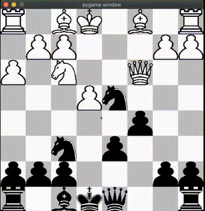
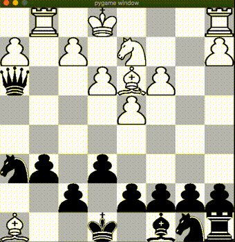

# Chess Game Testing

This repository contains the testing code for a Chess Game implementation. The purpose of this testing is to ensure the correctness and functionality of various components of the Chess Game.

## Autor
Damian Tissembaum

# Testing Framework

The testing is implemented using the pytest framework, a popular testing library for Python. It provides a simple and efficient way to write and execute tests.

# Test Levels

The tests in this repository are divided into three levels:

## Unit Tests
These tests focus on individual units or functions of the codebase. They ensure that each unit behaves as expected in isolation.
## Integration Tests
These tests examine the interaction between different units or components of the codebase. They ensure that the integration of these components works correctly.
## System Tests
These tests evaluate the entire system or application as a whole. They simulate real-world scenarios and verify that the system behaves as expected from end to end.

# How to Run the Tests

To run the tests, follow these steps:

1. Clone the repository to your local machine.
2. Go to the file ex_4_pytest.py (if you have already installed the package of the game that is explained next)
3. Run the program
View the test results and any failures or errors reported by pytest.


# Python Chess
A GUI chess game including a simple AI, all written in Python.
<p align="center">

</p>

## Index
1. [About](#about)
2. [Demo](#demo)
3. [Usage](#usage)
    * [Installation](#installation)
    * [Commands](#commands)
4. [Credits](#credits)
5. [License](#license)

<a name="about"></a>
## About
This project includes a full chess engine, gui engine, and an AI engine. The AI engine utilizes the minimax and alpha beta pruning algorithms.

<a name="demo"></a>
## Demo
| Human vs Human   | Human vs AI (AI is controlling black)  |
|:----------------------|:------------------|
| |  |
| [First full human vs human test run](https://www.youtube.com/watch?v=yuVbVM19GIY) | [First full human vs AI test run](https://www.youtube.com/watch?v=npUyYXWPDfI) |

<a name="usage"></a>
## Usage
To install this project, make sure you have the correct version of Python and Pygame. Certain versions of pygame are no longer supported on macOS Catalina.

<a name="installation"></a>
### Installation
- Switch to Python3.
- Follow the code below to create virtual environment and install the necessary libraries.
(Currently tested on Python 3.7.9 with Pygame 2.0.0dev8 and Python 3.8.2 with Pygame 2.0.0 on macOS Catalina)
```
git clone https://github.com/boosungkim/python-chess.git
cd python-chess
python3 -m venv venv
source venv/bin/activate
pip install pygame
```

<a name="commands"></a>
### Commands
- To start the game, run `python3 -W ignore chess_gui.py`, then select the game mode you want to play in the command line.
- To undo a move, press `u`.
- To reset the board, press `r`.

<a name="credits"></a>
## Credits
All three engines were written by Boo Sung Kim, but the move log and the GUI engine code was initially inspired by Eddie Sharick and the AI engine was originally inspired by Sebastian Lague's pseudocode.

Special thanks to Savid for helping me beta test the chess game many times.

<a name="license"></a>
## License
This project is licensed under the GNU GPLv3 License - see the [LICENSE](./LICENSE) file for details.